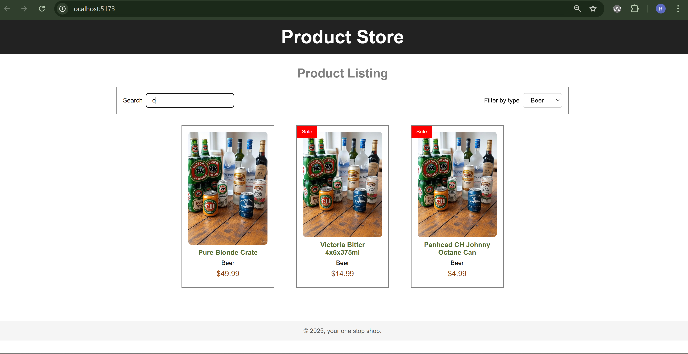
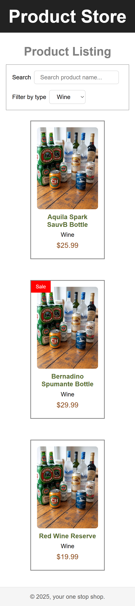

# Products Listing

This project is a React-based application for listing products.

## Tech Stack

-   **Vite**: Fast build tool and development server for modern web projects.
-   **React**: JavaScript library for building user interfaces.
-   **Redux**: State management library for predictable state handling.
-   **Vitest**: Blazing fast unit testing framework, integrated with Vite.
-   **React Testing Library**: Utilities for testing React components in a user-centric way.

## Steps to run the project

1. Install dependencies:
    ```bash
    npm install
    ```
2. Start development server:
    ```bash
    npm run dev
    ```
3. Run tests:
    ```bash
    npm run test
    ```
4. Application will run on url:
    ```bash
    http://localhost:5173/
    ```

## Following is the funtionality and fetures implemented

1. React components is used to build UI components and CSS flex properties is used to make app responsive.
2. Folder structure is made considering a big enterprise level application
3. RTK/Redux was not necessary for such small app but has used to demonstrate the knowledge
4. Search functionality and filter is implemented using redux and good practices of one way data flow is used
5. test cases are on high level due to cruch of time
6. Accessibility of the application is improved for better screen readers output
7. Error handling is done using error boundry and error in state

## Below is the screenshot of the application



## Mobile view


